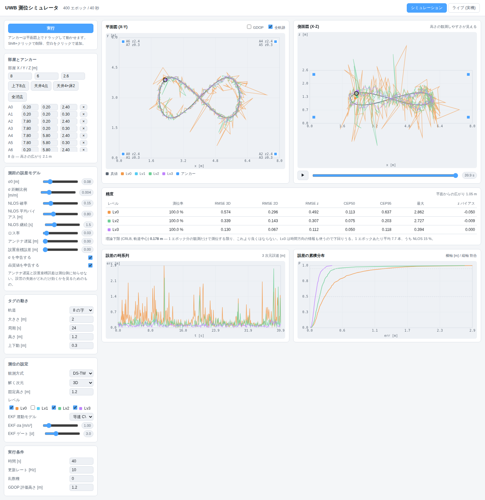
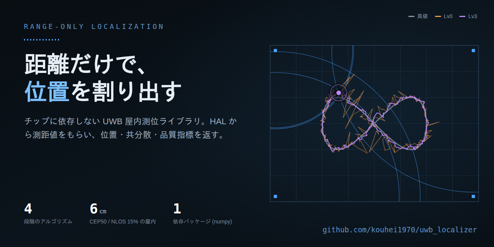

# uwb_localizer

UWB の**距離情報だけ**からタグの位置を割り出すライブラリ。

依存は **numpy だけ**。scipy を使わず Gauss-Newton も EKF も自前で書いてあるので、
そのまま C に移植できる (扱う行列は最大 6×6)。

## なぜ作ったか

**REYAX RYUW122 / RYUW122_Lite** が出たことがきっかけ。UWB は長らく
「DW1000 を素から立ち上げて数週間」の世界だったが、このモジュールは
**AT コマンドを打つだけで距離 (cm) が UART に出てくる**。ファームウェアを
書かなくても、その日のうちに測距できる。

ただし **距離は出るが、位置は出ない。** 複数の距離から座標を出すところは
自分でやることになる。しかもそこは、単なる連立方程式ではない —
屋内では見通しが切れて距離が伸び (NLOS)、アンカーを平らに並べると
高さが決まらず、天井配置では鏡像解が現れる。

**その間を埋めるのがこのライブラリ。** RYUW122 は専用対応が入っているが、
設計としては特定チップに縛っていない。DW1000/DW3000、NXP SR150、ESP32-UWB
など、**距離になってしまえば同じコードが動く**。

```
 ┌─────────┐   Measurement    ┌──────────────────────────────────────┐
 │  HAL    │ ───────────────→ │  前処理    スナップショット    追跡    │ → 位置
 │ (chip)  │  距離 / TDoA /   │  バイアス   閉形式 + WNLS      EKF    │   共分散
 └─────────┘  角度 / 品質値   │  外れ値除去  (Lv0-Lv2)        (Lv3)   │   品質指標
      ↑                       └──────────────────────────────────────┘
 実機 or シミュレータ (同じインターフェイスなので差し替え可能)
```

---

# 動くまで — ハードが無くても 5 分

UWB モジュールが 1 台も無くても、シミュレータで全部動く。まずこれを通してから
実機に行くのが早い。

## 用意するもの

- **Python 3.10 以上** (`python3 --version` で確認)
- git

## 1. 取ってくる

```bash
git clone https://github.com/kouhei1970/uwb_localizer.git
cd uwb_localizer
```

## 2. 仮想環境を作って入れる

```bash
python3 -m venv venv
source venv/bin/activate          # Windows は venv\Scripts\activate
pip install -e .
```

`-e` は「このフォルダをそのまま使う」という意味。コードを直せば即反映される。

> **実機 (RYUW122 など) につなぐなら** `pip install -e ".[serial]"` にする。
> シリアルポートを開く `pyserial` が一緒に入る。あとから入れ直しても構わない。

## 3. 動かす

```bash
python -m uwb_loc ui
```

ブラウザが開いて <http://127.0.0.1:8765> が出る。開かない環境なら
`--no-browser` を付けて、表示された URL を自分で開く。



左でアンカーを置き、誤差を振り、Lv0〜Lv3 の測位結果を見比べる画面。
**ここまでハードは 1 台も要らない。**

コマンドラインだけで数字を見たいなら:

```bash
python -m uwb_loc sim --nlos 0.2 --duration 40
```

```
アンカー 8 台  同一平面=False  平面からの広がり 1.05 m
400 エポック  1 エポックあたり平均 7.7 本

Lv0   測位率 100.0%  RMSE3D  0.631  RMSE2D  0.292  CEP50  0.134  CEP95  0.650  最大  3.955  [m]
Lv1   測位率 100.0%  RMSE3D  0.368  RMSE2D  0.160  CEP50  0.092  CEP95  0.264  最大  1.913  [m]
Lv2   測位率 100.0%  RMSE3D  0.312  RMSE2D  0.146  CEP50  0.081  CEP95  0.207  最大  2.758  [m]
Lv3   測位率 100.0%  RMSE3D  0.153  RMSE2D  0.081  CEP50  0.062  CEP95  0.138  最大  0.595  [m]
```

ここまで動けばインストールは成功。

---

# RYUW122 で実際に測位する

このリポジトリを作った動機のデバイス。専用の HAL と設定ツールが入っている。

詳細版は **[docs/RYUW122.md](docs/RYUW122.md)**。ここでは通しの手順を書く。

## 何台買えばいいか

RYUW122 は **1 台の ANCHOR が 1 台の TAG を名指しして測距する**。移動する側に
1 台、固定する側に複数台が要る。

固定側の台数と精度の関係を、シミュレータで測った結果 (8×6×2.6 m の部屋、
測距誤差 σ = 8 cm、NLOS 15%、5 seed 平均):

| 固定する台数 | 3D で解けるか | Lv2 RMSE3D | Lv3 RMSE3D | 測位率 |
|---|---|---|---|---|
| 3 台 | **解けない** | — | — | 0 % |
| 4 台 | ぎりぎり | 1.030 m | 1.230 m | 88.7 % |
| 5 台 | 一応 | 0.725 m | 1.265 m | 98.8 % |
| **6 台** | **実用ライン** | **0.441 m** | **0.236 m** | 100 % |
| 8 台 | 余裕 | 0.281 m | 0.160 m | 100 % |

読み取れること:

- **3D なら最低 4 台**。3 点は必ず同一平面上に乗るので、3 台では原理的に
  高さが決まらない (この場合ライブラリは解を返さない)
- **4〜5 台は「解ける」だけで実用ではない。** 1 本欠けるとすぐ解けなくなるので
  測位率が落ち、誤差も 1 m 級。**Lv3 (EKF) が Lv2 より悪くなる**のもこの領域で、
  幾何が痩せていると追従が安定しない
- **6 台から実用になる。** 測位率 100%、Lv3 で 24 cm

→ **移動用 ANCHOR 1 台 + 固定用 TAG 6 台 = 7 台**が現実的な目安。
まず試すだけなら 1 + 4 = 5 台でも位置は出る。

**台数を増やすと更新レートは落ちる。** ANCHOR は TAG を 1 台ずつ順に呼ぶので、
1 エポック ≒ 台数 × 1 回の測距時間。**台数に反比例**する。
2D でよい (高さが分かっている) なら 3 台から解けるので、レートを稼げる。

## 置き方 — 平らに並べない

**高さをばらすこと。** 天井の 4 隅に貼っただけだと、

- 高さがほとんど観測できない (どの距離も高さ変化に鈍い)
- 平面の上下に**距離が厳密に一致する 2 点** (鏡像解) ができて、測距値だけでは選べない

この配置で 3D の測位器を作ると警告が出る。対処は 3 つ:

1. **高さをばらす** ← 一番よい。天井 3 台 + 床付近 3 台など
2. `SolveConfig(dim=2, z_fixed=1.2)` で高さを固定して 2D で解く
3. `SolveConfig(z_bounds=(0, 2.3))` で「床と天井の間」という事前情報を与える

## どちらを ANCHOR にするか

**距離は ANCHOR 側の UART に出る。** ここが配置を決める。

### (A) 移動する側を ANCHOR にする ← **推奨・HAL が想定する構成**

```
PC ── USB シリアル ── RYUW122 (ANCHOR, 移動する)
                         ├── 測距 ──> RYUW122 (TAG) 部屋に固定
                         ├── 測距 ──> RYUW122 (TAG)
                         └── 測距 ──> RYUW122 (TAG) ...
```

**UART 1 本で全部の距離が揃う。** PC につないだ 1 台がそのまま
「位置を知りたいもの」になる。配線が最も簡単。

このとき、ライブラリでいう**「アンカー座標」は固定した TAG の座標**。
`Anchor.id` には TAG の `AT+ADDRESS` を入れる。名前が逆に感じるが、
「距離の基準になる固定点」という意味では同じもの。

### (B) 移動する側を TAG にする

一般的な UWB の構成だが、距離が各 ANCHOR の UART に散らばるので
**固定局の数だけホスト接続が要る**。集約する仕組みを自分で用意して
`TextHal` か `PushHal` に渡す方が早い。

## 手順 1 — 1 台ずつ設定する

**買ってきたままでは動かない。** `AT+ADDRESS` の出荷時値は全機同じ
(`DAVID123`) なので、そのまま並べるとアドレスが衝突して、どれを呼んで
いるのか決まらない。

まず今の状態を読む:

```bash
pip install -e ".[serial]"                                  # pyserial が要る
python -m uwb_loc ryuw122 info --serial /dev/ttyUSB0
```

```
  mode        0
  address     DAVID123      ← 全機これ。変える必要がある
  network_id  REYAX123
  channel     5
  ...
  uid         123456789012345678901234   ← 書き換え不可の機体固有値
```

> **`ADDRESS` は設定値で、機体固有値ではない。** 書き換えられない固有値は
> `UID` の方だが、`AT+ANCHOR_SEND` の宛先には使えないので、測位で使うのは
> 自分で振った 8 バイトの `ADDRESS`。

固定する TAG を 1 台ずつ設定する。**`--address` だけ変えて台数分繰り返す**:

```bash
python -m uwb_loc ryuw122 tag-setup --serial /dev/ttyUSB0 \
    --address TAG00001 --network-id MYROOM01 \
    --cpin FFFFFFFFFFFFFFFFFFFFFFFFFFFFFFFF --channel 9 --bandwidth 1
```

移動する ANCHOR は 1 台だけ:

```bash
python -m uwb_loc ryuw122 anchor --serial /dev/ttyUSB0 \
    --address ANCHOR01 --network-id MYROOM01 \
    --cpin FFFFFFFFFFFFFFFFFFFFFFFFFFFFFFFF --channel 9 --bandwidth 1
```

- `--network-id` / `--cpin` / `--channel` / `--bandwidth` は **全機で同じ値**。
  1 台でも違うと通信しない
- `--address` は **機体ごとに違う値** (8 バイト ASCII ちょうど)
- 設定は Flash に残るので、**一度書けば次回からは電源を入れるだけ**

## 手順 2 — TAG 側が応答できるようにする

TAG は `AT+TAG_SEND` でデータを積んでいないと ANCHOR の呼びかけに応答できず、
**距離が 1 本も出ない**。要点は「`AT+TAG_SEND` は送信ではなく、返信用の中身を
バッファに置いておくコマンド」で、**読まれるたびに空になるので積み直しが要る**。
理屈は [docs/RYUW122.md](docs/RYUW122.md) の
「`AT+TAG_SEND` は『送信』ではなく『郵便受けに入れておく』」に書いた。

本来は TAG 側の MCU の仕事。**MCU を用意する前に PC で試したい**なら、
ライブラリが代わりに打てる (TAG 1 台につき 1 プロセス):

```bash
python -m uwb_loc ryuw122 tag --serial /dev/ttyUSB1 --address TAG00001 \
    --network-id MYROOM01
# TAG00001 として AT+TAG_SEND を積み続けます。Ctrl-C で終了。
#   積んだ 42 回 / 読まれた 37 回
```

「読まれた」が増えていれば ANCHOR との通信は成立している。

## 手順 3 — 座標を用意する

固定した TAG の座標が要る。単位は **m**、右手系で z が上。

巻き尺で測ってもよいが、**全台測る必要はない**。相互測距から配置を復元できる:

台数分の相互測距 (どの台とどの台が何 m 離れているか) を表にして渡すと、
座標を復元してくれる。**ヘッダ行と ID 列はあっても無くてもよく、届かなかった
ペアは空欄でよい**。

```
        ,TAG00001,TAG00002,TAG00003,TAG00004
TAG00001,0       ,7.60    ,9.62    ,5.60
TAG00002,7.60    ,0       ,6.03    ,9.62
TAG00003,9.62    ,6.03    ,0       ,7.60
TAG00004,5.60    ,9.62    ,7.60    ,0
```

**3D なら最低 4 台分**必要 (`--dim 2` なら 3 台)。

```bash
python -m uwb_loc survey distances.csv --dim 3     # → アンカー座標の JSON
```

これで出るのは**形だけ合った座標**(向きと原点は決まっていない)。実測した
3〜4 台を基準に実寸へ合わせる:

```python
anchors = ul.self_survey(dist_matrix, ids, dim=3)
anchors = ul.align_to_reference(anchors, {"TAG00001": [0.2, 0.2, 2.4],
                                          "TAG00002": [7.8, 0.2, 0.3],
                                          "TAG00003": [7.8, 5.8, 2.4],
                                          "TAG00004": [0.2, 5.8, 0.3]})
```

6 台・測距誤差 5 cm で試すと、**復元誤差は平均 3.7 cm / 最大 7.6 cm**。
巻き尺で全台測る作業は要らない。

## 手順 4 — つなぐ

### ブラウザ UI から (いちばん早い)

```bash
python -m uwb_loc ui
```

1. 左パネルでアンカーを配置し、**ID を TAG のアドレスに書き換える**
   (`TAG00001` など)
2. 「ライブ」タブ → ソースに **RYUW122 (シリアル)**
3. ポート (`/dev/ttyUSB0` など) を入れる。`NETWORKID` / `CPIN` /
   チャネル / 帯域も入れると、接続時にモジュールへ流し込む
4. 開始

**TAG アドレスを別に入力する欄は無い。** アンカー一覧の ID をそのまま順に
呼ぶので、2 箇所に書いてずれる事故が起きない。

状態表示に `測距 N 回 / 応答なし M 回` が出る。

### Python から

```python
import uwb_loc as ul

anchors = [                                   # 固定した TAG の座標 [m]
    ul.Anchor("TAG00001", [0.2, 0.2, 2.4]),
    ul.Anchor("TAG00002", [7.8, 0.2, 0.3]),
    ul.Anchor("TAG00003", [7.8, 5.8, 2.4]),
    ul.Anchor("TAG00004", [0.2, 5.8, 0.3]),
    ul.Anchor("TAG00005", [4.0, 0.2, 2.4]),
    ul.Anchor("TAG00006", [4.0, 5.8, 0.3]),
]

hal = ul.Ryuw122Hal.from_serial(
    "/dev/ttyUSB0",
    [a.id for a in anchors],                  # 呼ぶ TAG の順番
    anchors=anchors,
    config=ul.Ryuw122Config(
        network_id="MYROOM01",                # 全機で揃える (8 バイト)
        address="ANCHOR01",                   # この機体のアドレス
        password="F" * 32,                    # 全機で揃える (32 文字)
        channel=9, bandwidth=1,
        calibration_cm=-11,                   # AT+CAL による粗補正
    ),
)

for fix in ul.Pipeline(hal, level="Lv2").run():
    if fix.ok:
        print(f"{fix.position.round(2)}  ±{fix.sigma:.2f} m  ({fix.n_used} 本)")
```

`open()` した時点で `AT+MODE=1` から順に設定を流し込み、そのあと TAG を
順に呼び続ける。流し込んだ結果は `hal.setup_log` に残る。

## 位置が出ないときの切り分け

**症状はどれも「応答なし」に見える**ので、上から順に潰す。

| 確かめること | やり方 | 直し方 |
|---|---|---|
| ポートが開くか | `python -m uwb_loc ryuw122 info --serial <port>` | 応答が無ければポート名・ボーレート (既定 115200)・配線 |
| 設定が入っているか | 同上の出力を読む | `mode` が ANCHOR 側で 1、TAG 側で 0 か |
| 全機で揃っているか | 各機で `info` | `network_id` / `cpin` / `channel` / `bandwidth` が 1 台でも違えば通信しない |
| アドレスが衝突していないか | 各機で `info` | 全部 `DAVID123` のままなら未設定 |
| TAG が応答できるか | `ryuw122 tag` の「読まれた」回数 | 0 なら上のどれかが合っていない |
| 距離の値は妥当か | `python -m uwb_loc sniff --serial <port>` | 生の `+ANCHOR_RCV` を目視。cm 単位で出ているか |
| 座標が合っているか | `ul.gdop_at(点, anchors)` | 距離は出るのに位置が飛ぶなら座標か配置を疑う |
| 配置が平らでないか | `ul.anchor_condition(anchors)` | `coplanar=True` なら高さをばらす |

## 実機での確認について

**実機での動作確認は行っていない。** 仕様書どおりに応答する模擬モジュールを
作り、AT コマンドの順序・`+ANCHOR_RCV` の解析・cm→m 換算・ポーリング・
TAG 側の設定と `AT+TAG_SEND` の積み直し・測位までを検証している
(`tests/test_ryuw122.py`、22 件)。仮想シリアル (pty) 経由で、UI からの一発接続と
CLI の設定書き込みも通してある。

**実機で試してもらえるとありがたい。** 違いがあれば、まず

```bash
python -m uwb_loc sniff --serial /dev/ttyUSB0
```

で生の出力を見てほしい。`+ANCHOR_RCV` の形が仕様書と違っていれば
`uwb_loc/hal/ryuw122.py` の `parse_anchor_rcv` を直せば済む。
Issue に生の出力を貼ってもらえれば対応する。

---

# RYUW122 以外につなぐ

チップ非依存の部分。**測位側のコードは何を使っても変わらない。**

| 方法 | 書く量 | 向いている場面 |
|---|---|---|
| **HAL なし** | 3 行 | 既に自分でパースしている。**まずこれ** |
| **`TextHal`** | 正規表現 1 本 | ファームを触れず、出力形式も変えられない |
| **`JsonLinesHal`** | ファームに `printf` 1 つ | ファームを書ける。時刻・品質値を正確に載せられる |
| **`PushHal`** | 押し込む 1 行 | BLE 通知 / MQTT / ROS / UDP など**読みに行けない経路** |
| **`UwbHal` を継承** | 20 行 | 再接続など、ストリームを自分で握りたい |
| **`Ryuw122Hal`** | ポートを指定するだけ | **REYAX RYUW122 / RYUW122_Lite** |

## 既に自分でパースしているなら HAL は要らない

ID と距離が手元にあるなら、**3 行**で位置が出る。

```python
est = ul.make_estimator("Lv2", anchors)

readings = my_uart_read()        # [("A0", 3.214), ("A1", 2.887), ...]  距離は m
batch = ul.MeasurementBatch(t=time.monotonic(),
                            measurements=[ul.Measurement(a, d) for a, d in readings])
fix = est.update(batch)          # → fix.position, fix.sigma, fix.gdop
```

## 出力形式が分からないなら覗く

多くのモジュールは、何もしなくても既に距離をシリアルに吐いている。

```bash
python -m uwb_loc sniff --serial /dev/ttyUSB0 --unit mm --prefix A
```

```
解釈できた行  39 / 40
使った正規表現  (?P<anchor>\d+)\s*,\s*(?P<dist>-?[\d.]+)
見つかったアンカー ID  ['A0', 'A1', 'A2', 'A3']
距離の範囲  2.887 〜 5.102 m  (単位 --unit mm として換算)
  → 妥当な範囲です。次はアンカー座標を用意してください。
```

出た正規表現をそのまま渡せば終わり。**ファームの改造も Python のクラス書きも要らない。**

```python
hal = ul.TextHal.from_serial("/dev/ttyUSB0", 115200,
                             r"range,(?P<anchor>\d+),(?P<dist>\d+)",
                             anchors=anchors, unit="mm", anchor_prefix="A")
for fix in ul.Pipeline(hal, level="Lv2").run():
    if fix.ok:
        print(fix.position.round(2), fix.sigma)
```

JSON Lines を吐けるなら、この 1 行で済む (`a` と `d` が必須、他は任意):

```json
{"t":12.345,"meas":[{"a":"A0","d":3.214,"q":0.93},{"a":"A1","d":2.887}]}
```

→ 動く最小形は [`examples/03_minimal_integration.py`](examples/03_minimal_integration.py)

**経路 (UART か否か) は問わない。** ライブラリはシリアルポートもソケットも
直接は触らない。シリアル・TCP・UDP・BLE・MQTT・ROS・ファイル、何で届いても同じ。

## 渡す情報は 3 つだけ

| | 何 | 必要な場面 |
|---|---|---|
| 1 | **アンカー ID と距離 [m]** | 必須 |
| 2 | **アンカー座標** | 必須 (自己測量で推定してもよい) |
| 3 | **時刻 [s]** | **Lv3 (EKF) のみ**。Lv0-Lv2 は使わない |

時刻の有無は効く。実測 (8 台配置、10 Hz、NLOS 10%、RMSE 3D):

| 時刻の与え方 | Lv3 | Lv2 |
|---|---|---|
| ファームが出す時刻 | **0.21 m** | 0.43 m |
| 無し (ログを一気に流す) | 1.33 m | 0.43 m |
| 無し + `rate_hz=10` で合成 | **0.21 m** | 0.43 m |

## 何をしないか

このライブラリは**測位の計算だけ**を担当する。

| | |
|---|---|
| **やる** | 距離 → 位置 (最小二乗・ロバスト化・カルマンフィルタ)、NLOS 除去、<br>共分散と品質指標、配置評価 (GDOP/CRLB)、自己測量、アンテナ遅延推定 |
| **やらない** | **UWB チップの制御** (SPI/レジスタ、割り込み)、**測距シーケンス** (DS-TWR の<br>フレーム往復、タイムスタンプ処理)、アンカーの設置 |

つまり **「測距値が既に取れている」ところから始まる**。RYUW122 なら AT コマンド
だけで届くが、DW3000 を素から立ち上げるならここに来るまでに数週間かかる。

→ **[docs/BRINGUP.md](docs/BRINGUP.md)** にモジュール別の目安をまとめてある。

---

# 測位アルゴリズム

**同一インターフェイスで差し替えられる**測位器を 4 段階そろえてある。

| Lv | 中身 | 想定 |
|---|---|---|
| **Lv0** | LLS 三辺測量 (閉形式・反復なし) | 配線と座標系の確認、初期値供給 |
| **Lv1** | 重み付き非線形最小二乗 (GN/LM) + χ² ゲート | 見通しの良い環境 |
| **Lv2** | Beck 厳密解 + Huber-IRLS + 片側損失 | **NLOS のある屋内の既定** |
| **Lv3** | 密結合 EKF (CV/CA) | **移動体・ドローン** |

```python
est = ul.make_estimator("Lv2", anchors)
fix = est.update(batch)
print(fix.position, fix.sigma, fix.gdop, fix.excluded)
```

屋内の精度を決めるのは測距ノイズではなく **NLOS** (見通しが切れると距離が伸びる)。
NLOS 率を上げるほどレベル間の差が開く。

| NLOS 率 | Lv0 | Lv1 | Lv2 | Lv3 |
|---|---|---|---|---|
| 0 % | 0.193 | 0.177 | 0.177 | **0.116** |
| 15 % | 0.607 | 0.376 | 0.311 | **0.172** |
| 35 % | 1.049 | 0.799 | 0.637 | **0.328** |

(RMSE 3D [m]、8 台立体配置、σ₀ = 8 cm、10 Hz、5 seed 平均)

**ただし台数が少ないと Lv3 は有利にならない** (上の「何台買えばいいか」の表)。
幾何が痩せている間は Lv2 の方が安定する。

## 設営を助ける道具

現場で精度が出ない原因は、たいていアルゴリズムではなく設営とキャリブレーション。

```python
ul.gdop_at([4, 3, 1.2], anchors)      # その点の幾何精度劣化係数
ul.crlb_at([4, 3, 1.2], anchors)      # 位置誤差の理論下限 [m]
ul.anchor_condition(anchors)          # 同一平面かどうか (3D では致命的)

anchors = ul.self_survey(dist_matrix, ids, dim=3)   # 相互測距からアンカー配置を推定
anchors = ul.align_to_reference(anchors, {"A0": [0, 0, 2.4], ...})

delays = ul.estimate_antenna_delays(anchor_ids, measured, true_distance)
```

---

# ブラウザ UI

```bash
python -m uwb_loc ui                    # 自分の PC で開く
python -m uwb_loc ui --host 0.0.0.0     # 同じ LAN の端末から開く
python -m uwb_loc ui --no-browser       # 自動で開かない
```

外部 CDN を一切使わない単一ページなので、ネットワークのない現場でも動く。

- アンカーを平面図上でドラッグして配置し、**GDOP ヒートマップ**で弱い場所を確認
- 誤差モデル (σ、NLOS 確率・継続時間・バイアス、ロス率、アンテナ遅延、設置誤差) を振る
- Lv0〜Lv3 を**同じ観測列**に通して比較。アルゴリズムの差だけが見える
- 「ライブ」タブから実機の観測を流し込んで表示。**RYUW122・テキスト (正規表現)・
  JSON Lines**、ファイル / TCP / シリアルのどれでも読める

スマホ・タブレットからも使える (1 列レイアウト、指でのドラッグ対応)。
`--host 0.0.0.0` のときは起動時に表示される LAN アドレスをブラウザに入れる。
**認証はないので信用できる回線でだけ**使うこと。

# CLI

```bash
python -m uwb_loc ui --port 8765
python -m uwb_loc sim --levels Lv0,Lv2,Lv3 --nlos 0.2 --log run.jsonl
python -m uwb_loc replay run.jsonl --level Lv3 --out fixes.csv
python -m uwb_loc gdop --room 8 6 2.6 --n-low 0     # 天井のみ配置を評価
python -m uwb_loc sniff --serial /dev/ttyUSB0       # 実機の出力を覗く
python -m uwb_loc survey distances.csv --dim 3      # 相互測距 → アンカー配置
python -m uwb_loc ryuw122 info --serial /dev/ttyUSB0        # RYUW122 の設定を読む
python -m uwb_loc ryuw122 tag-setup --serial /dev/ttyUSB0 --address TAG00001
```

`pip install` すると `uwb-loc` コマンドも入る (`uwb-loc ui` のように書ける)。

# ドキュメント

| | |
|---|---|
| [docs/RYUW122.md](docs/RYUW122.md) | **REYAX RYUW122 の詳細** (配置、AT 設定、`AT+TAG_SEND` の仕組み) |
| [docs/BRINGUP.md](docs/BRINGUP.md) | **実機立ち上げ** (何を用意し何を渡すか、モジュール別の目安) |
| [docs/UWB.md](docs/UWB.md) | 使い方 |
| [docs/UWB_PROTOCOL.md](docs/UWB_PROTOCOL.md) | **HAL とのデータ交換仕様** (単位・座標系・時刻の規約、JSON Lines) |
| [docs/UWB_ALGORITHMS.md](docs/UWB_ALGORITHMS.md) | **アルゴリズムの導出** (式と実装の対応、踏んだ罠) |
| [docs/UWB_POSITIONING.md](docs/UWB_POSITIONING.md) | 手法選定の経緯 |

# 例

```bash
python examples/01_quickstart.py            # ハードなしで Lv0-Lv3 を比較
python examples/02_custom_hal.py            # 自前の UWB 用 HAL を書く
python examples/03_minimal_integration.py   # つなぎ方 3 通りの最小形
```

# 開発

```bash
pip install -e ".[dev]"
python -m pytest -q      # 109 件
```

テストは数値の一致だけでなく、**アルゴリズムが持つべき性質**を検証している
(無雑音なら閉形式が真値を返す、Beck は LLS より偏りが小さい、NLOS 1 本で
Lv2 が Lv1 より崩れない、EKF がアンカー 2 本でも追従する、
ゲートに閉じ込められても復帰する、自己測量が配置を復元する、など)。

# SNS カード



`docs/social/og-card.png` (1280x640)。GitHub の Settings → General →
Social preview に登録すると、リポジトリを共有したときにこの画像が出る。

図は**実際にライブラリを走らせた出力**で、飾りではない。細い円弧は
ある 1 エポックで得られた測距値 (高さの差を抜いた水平距離) で、
綺麗に 1 点で交わらないのが本題。その食い違いを詰めた結果が紫の軌跡。

```bash
pip install playwright                 # ブラウザ本体は同梱のものを使う
python docs/social/build_card.py
```

# ライセンス

MIT — [LICENSE](LICENSE)

ベンダのデータシート (REYAX RYUW122 の AT コマンド仕様書など) は
**同梱していない**。著作権がメーカーにあり、この MIT ライセンスでは
再配布できないため。入手先は
[`docs/datasheets/README.md`](docs/datasheets/README.md)。
